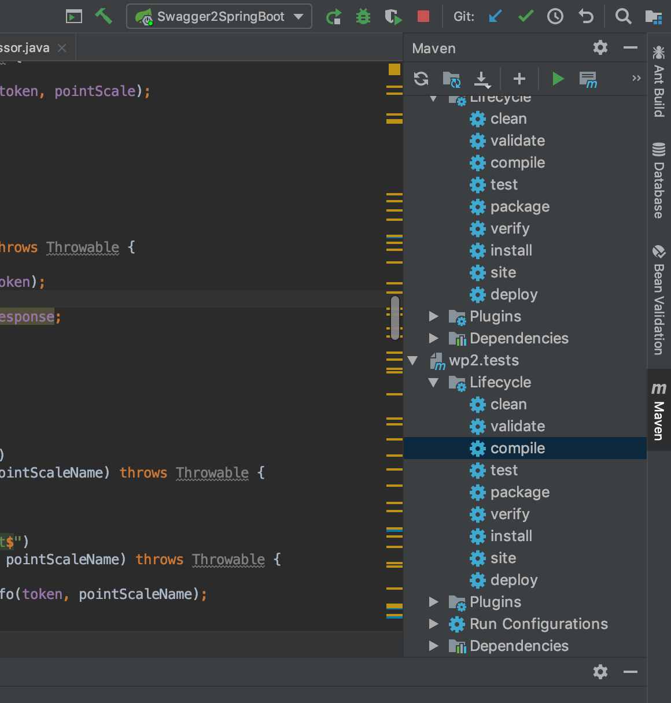

# AMT-WP2

Voici la marche a suivre afin de lancer notre pojet.

1.  démarer le container docker de la base de données
```bash
# Depuis la racine du projet
cd docker/
docker-compose up -d --build
```

2. Contrôler que l'adresse IP inscrite dans le fichier **application.properties** soit la même que votre container

   1. Dans le fichier : **spring-server/src/main/resources/application.properties**

   2. Contrôler l'IP du serveur MySQL à la ligne 10

      ```json
      [...]
       
      spring.datasource.url=jdbc:mysql://localhost:3306/AMT_WP2?useSSL=false
       
      [...]
      ```
3. Se connecter à la base de données via Adminer
   1. **Adminer** : [MYSQL_HOSTNAME]:6060
      **login** : root
      **mdp** : root
4. et faire l'INSERT suivant
- ```sql
    USE AMT_WP2;
    INSERT INTO application (`id`, `name`, `token`) VALUES(NULL, "Stack Overflow", "fcb3cd0c1efd8afe09d0505e46cefa4c");
    ```

5. Compilation et exécution du projet

```bash
mvn clean install
```

Puis build & run du projet depuis Intellij



6. l'application est disponible sur le liens suivant : http://localhost:8080/api